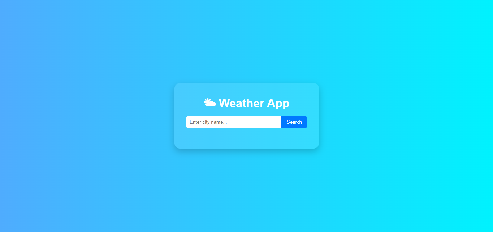

# 🌦️ Weather App

A simple weather application that allows users to search for a city and get real-time weather information.  
This project is deployed on **GitHub Pages**: [Live Demo](https://loai-radwan.github.io/weather/)

---

## 🚀 Features
- Search for weather by city name  
- Display temperature, weather condition, and location  
- Simple and clean UI  
- Responsive design  

---

## 🛠️ Technologies Used
- **HTML5**  
- **CSS3**  
- **JavaScript (ES6)**  
- **Weather API** (e.g., [OpenWeatherMap](https://openweathermap.org/api))  

---

## 📌 Usage
1. Open the [Weather App](https://loai-radwan.github.io/weather/).  
2. Enter a city name in the search box.  
3. Press **Enter** or click the search button.  
4. View the current weather information.  

---

## 📷 Screenshot

---

## 💡 Future Improvements
- Add 5-day forecast  
- Support for multiple languages  
- Show weather icons and background based on conditions  
- Add "current location" weather detection  

---

## 📜 License
This project is open-source and available under the **MIT License**.
